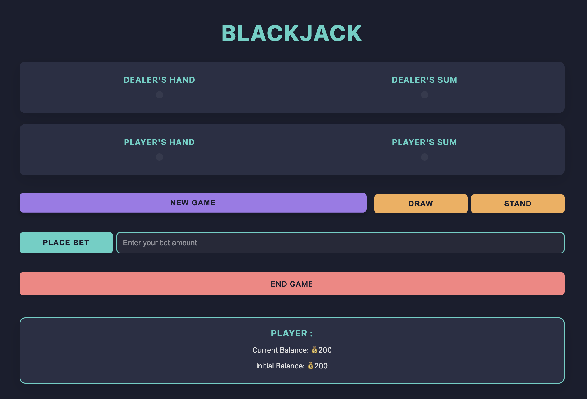
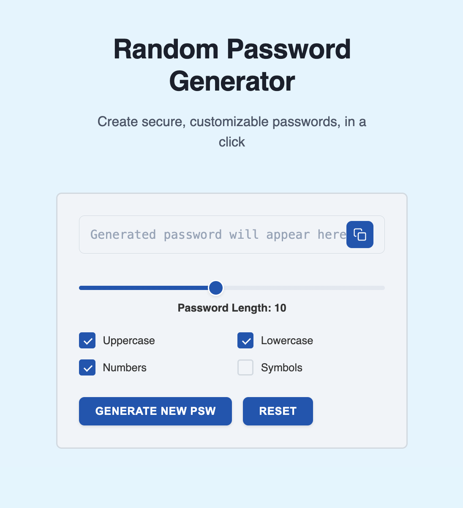
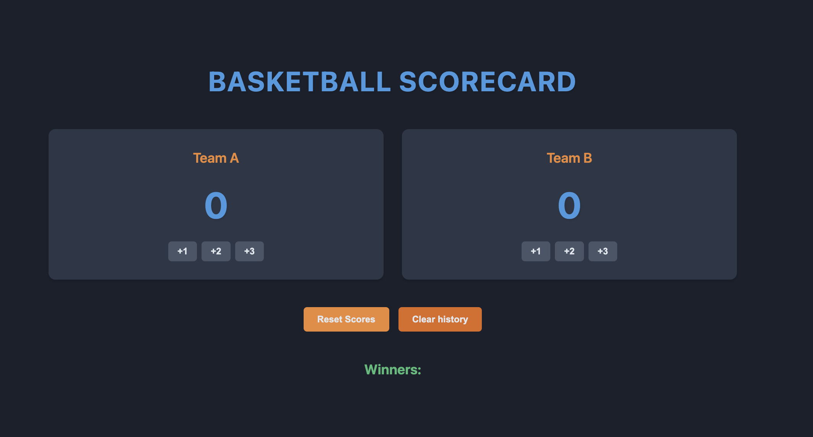
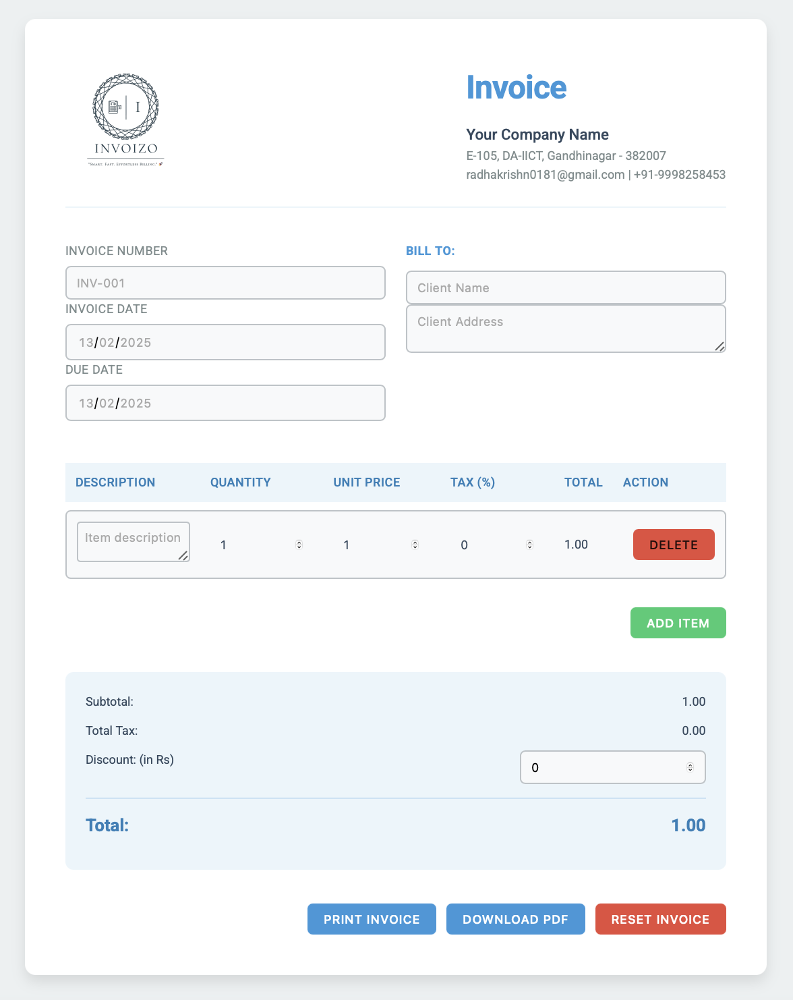

# Basic JS Projects

Welcome to the **Basic JS Projects** collection! 🚀 This repository showcases engaging JavaScript projects that help sharpen your coding skills while having fun!

**Note:** The CSS styling for these projects was enhanced using **Vercel v0** to improve the visual experience. 🎨

## 🌟 Featured JavaScript Projects

### 1. Blackjack Game 🎲

A simplified version of the classic Blackjack game where you can:

- **Bet** and play against the dealer.
- Learn game logic and state management.
- Explore DOM manipulation and event handling in JavaScript.



---

### 2. Random Password Generator 🔐

Generate secure, random passwords with a click! Key features:

- Customize password length and character types.
- Understand randomness and function design in JavaScript.
- Perfect for quick password generation for your daily needs.



---

### 3. Basketball Scorecard 🏀

A simple scoreboard for tracking basketball game points. Highlights:

- Increment and decrement team scores.
- Interactive user interface.
- Great practice for event handling and state management in JavaScript.



---

### 4. Invoizo - Invoice Generator 🧾

A modern invoice generator that saves data using **Local Storage**. Features:

- Add, edit, and delete invoice items dynamically.
- Store invoice details persistently with Local Storage.
- Export invoices as PDFs.
- Real-time calculations for subtotal, tax, and total amount.



---

### 5. LeadsTracker - Chrome Extension 🔖

A **Google Chrome Extension** that allows users to save the URL of the current tab while working. Features:

- Store URLs in **Local Storage** for future reference.
- One-click saving of the active tab's URL.
- User-friendly interface with easy-to-delete saved links.


---

### 6. Unit Converter App 📏

A versatile **Unit Converter** for different measurement categories:

- **Length**: Convert between meters and feet.
- **Volume**: Convert liters to gallons.
- **Mass**: Convert kilograms to pounds.
- **Speed**: Convert km/h to mph.
- **Area**: Convert square meters to square feet and acres.
- **Temperature**: Convert Celsius to Fahrenheit and Kelvin dynamically.


---

## 🛠️ Installation & Usage

1. Clone this repository to your local machine:
   ```sh
   git clone https://github.com/yourusername/basic-js-projects.git
   ```
2. Navigate to the project folder:
   ```sh
   cd basic-js-projects
   ```
3. Open the desired project folder in **VS Code** or your preferred editor.
4. Launch the project in your browser by opening the `index.html` file.

---

## 🎨 Learning & Experimentation

Each project is an opportunity to dive into JavaScript fundamentals. Feel free to:

- Experiment with new features and logic.
- Add interactivity and animations.
- Expand these projects into fully functional applications.

---

## 🚀 Future Enhancements

- Improve UI with CSS animations and styling.
- Add more interactive JavaScript functionalities.
- Make projects responsive for better user experience.

---

## 🌐 Connect & Share

If you found these projects helpful or have suggestions, feel free to:

- ⭐ Star this repository
- 🖍 Submit an issue or feature request

**Happy Coding! 💻**
